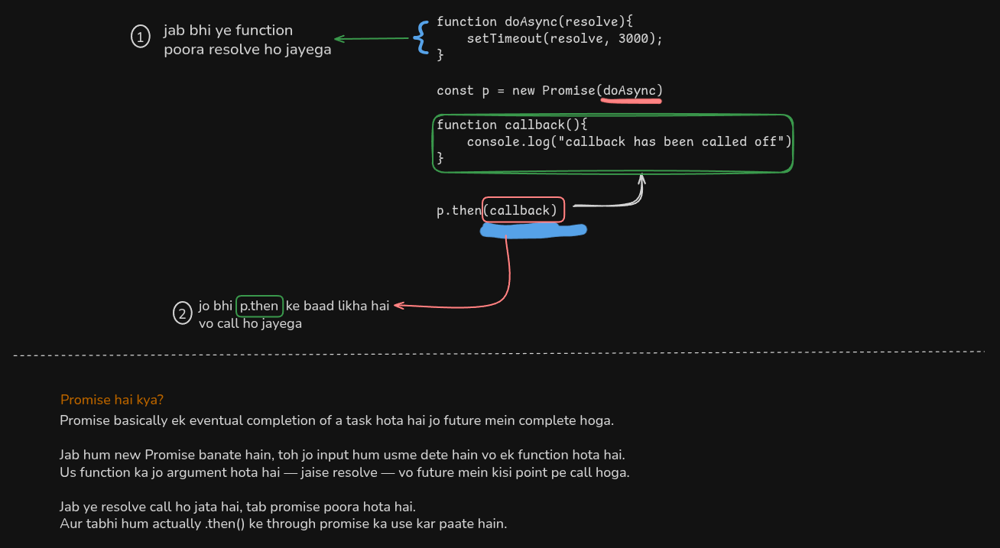

# Promises in JavaScript – Revision Friendly Notes

## Overview

Is folder mein tumhe callback aur promise based asynchronous code ke examples milenge. Ye notes likhe gaye hain taki revision ke time pe tumhe har concept turant samajh aa jaye, bina code ke details mein ghuse.

 

---

## 2.1_promises.js

### Callback Based Approach

- **Callback**: Function ko as argument pass karte hain, jo async operation ke complete hone par call hota hai.
- **setTimeout(main, 5000)**: 5 second baad `main` function call hoga.
- **Problem**: Agar zyada nested callbacks ho jaayein, toh code samajhna mushkil ho jaata hai (callback hell).

### Promises Approach

- **Promise**: Ek object hai jo future mein kisi async operation ke complete hone (ya fail hone) ka result represent karta hai.
- **Syntax**: `.then()` method se callback attach karte hain, jo promise resolve hone par call hota hai.
- **Promisify**: Callback based function ko promise returning function mein convert karna.

**Key Takeaway:**  
Callback se code likhna simple hai, lekin promises se code readable, maintainable aur scalable ho jaata hai.

---

## 2.2_promises_examples.js

### Example 1: Basic Promise Structure

- Promise constructor ek function leta hai jisme `resolve` call karte hain jab async kaam complete ho jaata hai.
- `.then()` se result handle karte hain.

### Example 2: Direct Callback Approach

- Directly callback pass karte hain aur async operation ke complete hone par usse call karte hain.
- Promises ki tarah chaining possible nahi hoti.

**Key Takeaway:**  
Direct callback approach choti cheezon ke liye theek hai, lekin promises se chaining aur error handling easy ho jaati hai.

---

## 2.3_promisifiedVersion_example.js

### Combining setTimeout with Promises

- Yahan ek function hai jo promise return karta hai, aur usme setTimeout se async operation simulate kiya gaya hai.
- Console logs se pata chalta hai ki kaunsa code pehle execute hota hai aur kaunsa baad mein (async flow samajhne ke liye).

**Execution Order:**
1. Top of file log
2. Promise creation ka log
3. End of file log
4. 10 seconds baad: setTimeout ka log
5. Promise resolve hone par: callback ka log

**Key Takeaway:**  
Async code main thread ko block nahi karta. Promise resolve hone tak baaki code execute hota rehta hai.

---

## Revision Tips

- **Callback**: Function jo async operation ke complete hone par call hota hai.
- **Promise**: Future value ko represent karta hai, `.then()` se handle karte hain.
- **Promisify**: Callback based code ko promise returning function mein convert karna.
- **Kyu use karein?**: Promises se code readable, maintainable, aur error handling easy ho jaati hai.

---

## Hinglish Gyaan

- Zyada nested callbacks = callback hell. Promises se yeh problem solve hoti hai.
- Promises ka syntax clean hai, chaining aur error handling easy hai.
- Async code likhne ka best practice: Promises ya async/await use karo.

---

**Quick Recap:**  
- Callback: Simple, but not scalable.
- Promise: Clean, chainable, better error handling.
- Promisify: Callback based function ko promise returning bana do.

---

Happy Learning & Revision!  
Agar koi concept bhool jao toh yeh file khol ke ek baar padh lo, sab yaad aa jayega!